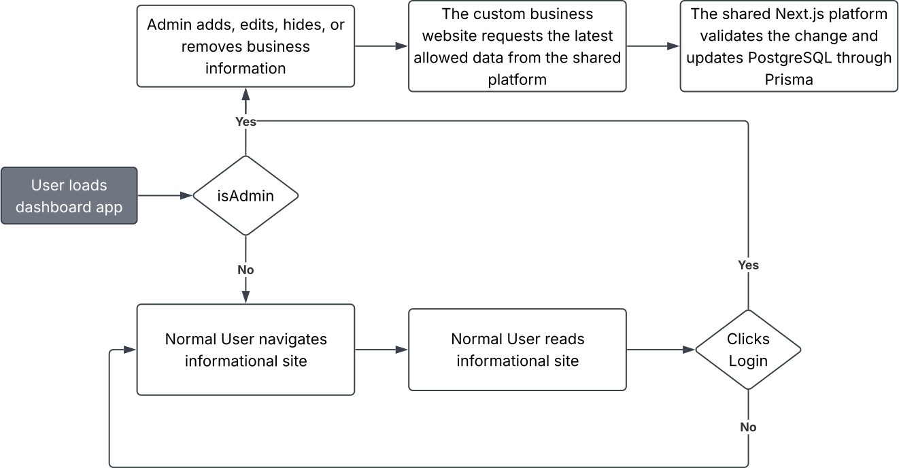

# Minimal Viable Product

## Project Model

Each business remains a custom-built frontend with its own design, domain, branding, and page structure as the sponsors please. However, the backend and admin dashboard will remain shared, with a required admin login. This allows each business to read out its own data and modify any data on their own terms. In the beginning of the development phase, the domain will stay as a localhost at an incrementing PORT number, but each production website will use its own domain, such as `https://business-name.com/`. Authentication will be handled by Auth.js, which will allow users to log in using Google, Twitter, Apple, and many more official providers.

## Application Structure

- **Shared platform:** One Next.js application contains the admin dashboard, authentication, Route Handlers, and Prisma database access.
- **Custom client website:** Each business gets its own Next.js project, allowing for unique business design needs and loading information from the same shared system using only their datasets.
- **Shared database:** One PostgreSQL database stores data for all businesses. Business-owned records should include a business identifier so that each administrator only manages the correct business.

## Basic Workflow

## Initial Scope

- One shared backend/platform
- One shared PostgreSQL database
- One shared admin dashboard
- Auth.js authentication
- Editable menu, prices, hours, locations, contact information, and images
- First custom website: Tacos El Guero

## Out of Scope

- Browser-level end-to-end testing
- Multiple user roles
- Custom per-business database schemas
- API key for outside systems to call on admin API routes
- Onboarding clients via invitation
  - Adding new database entry
- Logging service like Sentry, Logtail, Datadog, etc.
  - For checking issues from clients from a deeper perspective
- For client business app, determining travel time to reach business location
