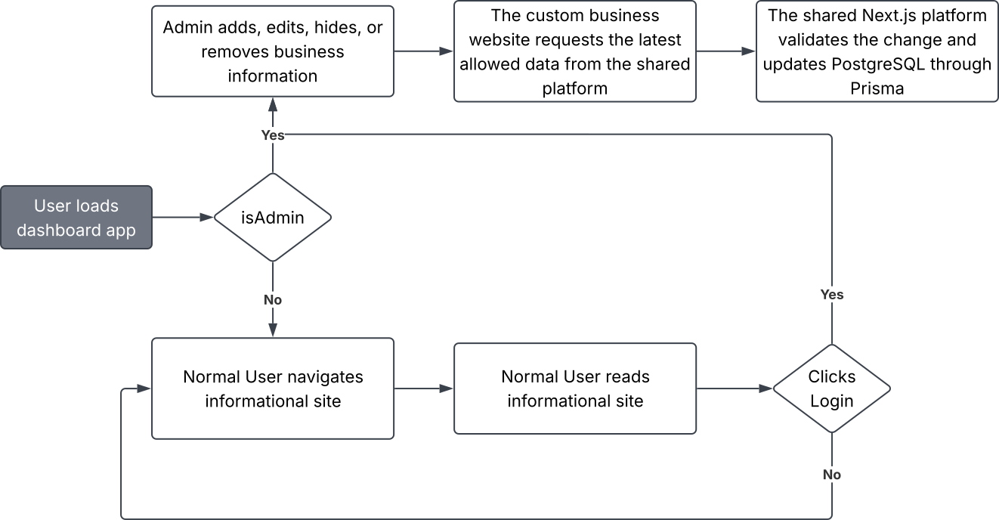

# Minimal Viable Product

## Project Model

Each business remains a custom-built frontend with its own design, domain, branding, and page structure as the sponsors please. However, the backend and admin dashboard will remain shared, with a required admin login. This allows each business to read out its own data and modify any data on their own terms. Each production website will use its own domain, such as `https://business-name.com/`. Authentication will be handled by Auth.js, which will allow users to log in using Google, and many more official providers after MVP completion. The client website requires a Business Api Key that is only generated in the dashboard. Only users with developer role can do that.

## Application Structure

- **Shared platform:** One Next.js application contains the admin dashboard, authentication, Route Handlers, and Prisma database access.
- **Custom client website:** Each business gets its own Next.js project, allowing for unique business design needs and loading information from the same shared system using only their datasets.
- **Shared database:** One PostgreSQL database stores data for all businesses. Business-owned records should include a business identifier so that each owner/administrator only manages the correct business.

## Basic Workflow

## Initial Scope

- One shared backend/platform
- One shared PostgreSQL database
- One shared admin dashboard
- Auth.js authentication
- Business Api Key
- Editable menu, prices, hours, locations, contacts, socials, images, and more
- location based
  - Every business has at least one location and each location holds its own data (showed be either shared across all locations or not)
- First custom client website: Tacos El Guero

## Out of Scope

- Browser-level end-to-end testing
- Multiple user roles
- Custom per-business database schemas
- Onboarding clients via invitation
  - Adding new database entry
- Logging service like Sentry, Logtail, Datadog, etc.
  - For checking issues from clients from a deeper perspective
- For client business app, determining travel time to reach business location

- 3rd-party integration
  - UberEats
  - DoorDash
  - Grubhub
